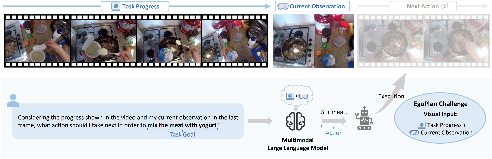

<div align="center">
<h1><a href="https://chenyi99.github.io/ego_plan_challenge/">Challenge@ICML 2024</a></h1>
</div>

<div align="center">
<p align="center">
  
</p>
</div>

## 📌Table of Contents
- [News](#news)
- [Introduction](#introduction)
- [Challenge Timeline](#challenge-timeline)
- [Data](#data)
- [Rules](#rules)
- [Getting Started](#getting-started)
- [Citation](#citation)

## 📢News

- **🚩[2024.5.1]** Training and validation datasets released! The [validation dataset](https://drive.google.com/file/d/1Hy-mWrtuDjuq29iCQxCQzk0htTJs8SHg/view?usp=drive_link) contains 3,355 multiple-choice questions with ground-truth answers, which has undergone strict human verification. The [training dataset](https://drive.google.com/file/d/139UXIgOXbK55tNlK03TBrdSWXdupfrL5/view?usp=drive_link) is automatically constructed and encompasses 50K instruction-following pairs. 
- **🎉[2024.5.1]** The EgoPlan Challenge begins! To register for our challenge, please fill out the [Google Form](https://docs.google.com/forms/d/e/1FAIpQLScnWoXjZcwaagozP3jXnzdSEXX3r2tgXbqO6JWP_lr_fdnpQw/viewform?usp=sf_link).


## 🚀Introduction

Multimodal Large Language Models (MLLMs) combine the exceptional reasoning and generalization capabilities of Large Language Models with the capacity to understand visual inputs. This integration has opened new possibilities for embodied task planning, which is essential for enabling autonomous agents to plan complex tasks in everyday environments, ultimately leading to the development of versatile AI assistants. The question then arises: ***how far are current MLLMs from becoming embodied planning generalists?***

The EgoPlan Challenge seeks to evaluate the planning capabilities of MLLMs in real-world scenarios by providing diverse environmental inputs. Participants must utilize MLLMs to predict the next feasible action based on real-time task progress videos, current visual observations, and open-form language instructions. The challenge is structured as multiple-choice questions, with accuracy serving as the metric for objective evaluation.

Focusing on everyday household activities, the EgoPlan Challenge includes realistic tasks, a wide range of actions, and complex real-world visual observations. This challenge presents a golden opportunity to explore and innovate using instruction-tuning, prompt-engineering, and other MLLM-related strategies to create effective embodied task planners. We welcome you to the EgoPlan Challenge!

<!-- Multimodal Large Language Models (MLLMs), combining the remarkable reasoning and generalization capabilities of Large Language Models with the ability to comprehend visual inputs, have opened up new avenues for embodied task planning. This is crucial for enabling autonomous agents to plan complex tasks in everyday environments, paving the way for
versatile AI assistants.
So we ask **how far are the current MLLMs from becoming an embodied planning generalist?**

The EgoPlan Challenge aims to assess the planning capabilities of MLLMs given diverse environmental inputs in real-world scenarios. Participants are required to use MLLMs to predict the next feasible action based on real-time task progress videos, current visual observations, and open-form language instructions. The questions are designed as multiple-choice problems and accuracy is adopted as the metric to ensure objective evaluation.

Set within the context of everyday household activities, the EgoPlan Challenge encompasses realistic tasks, diverse actions, and complex real-world visual observations. This is a golden opportunity to explore and innovate with instruction-tuning, prompt-engineering and any other MLLM related strategies for building effective embodied task planners. Welcome to the EgoPlan Challenge! -->


## 📆Challenge Timeline

- From now until July 1, 2024: Register for this challenge by filling out the [Google Form](https://docs.google.com/forms/d/e/1FAIpQLScnWoXjZcwaagozP3jXnzdSEXX3r2tgXbqO6JWP_lr_fdnpQw/viewform?usp=sf_link)
- May 1, 2024: Training set and validation set available
- June 1, 2024: Test set available, test server opens
- July 1, 2024: Test server closes, registration ends

## 📝Data

### Egocentric Videos
The EgoPlan datasets are constructed based on the two existing egocentric video sources: Epic-Kitchens-100 and Ego4D.

Download the RGB frames of [Epic-Kitchens-100](https://github.com/epic-kitchens/epic-kitchens-download-scripts). The folder structure of the dataset is shown below:
```
EPIC-KITCHENS
└── P01
    └── rgb_frames
        └── P01_01
            ├── frame_0000000001.jpg
            └── ...
```

Download the videos of [Ego4D](https://ego4d-data.org/#download). The folder structure of the dataset is shown below:
```
Ego4D
└──v1_288p
    ├── 000786a7-3f9d-4fe6-bfb3-045b368f7d44.mp4
    └── ...
```
 
### EgoPlan Validation and Test Datasets
The multiple-choice questions in validation and test sets are presented as follows: 

<div align="center">
<p align="center">
  
</p>
</div>

Currently we have released the validation set [EgoPlan_validation.json](https://drive.google.com/file/d/1Hy-mWrtuDjuq29iCQxCQzk0htTJs8SHg/view?usp=drive_link). Below shows a data sample:
```
{
    "sample_id": 115,
    "video_source": "EpicKitchens",
    "video_id": "P01_13",
    "task_goal": "store cereal",
    "question": "Considering the progress shown in the video and my current observation in the last frame, what action should I take next in order to store cereal?",
    "choice_a": "put cereal box into cupboard",
    "choice_b": "take cereal bag",
    "choice_c": "open cupboard",
    "choice_d": "put cereal bag into cereal box",
    "golden_choice_idx": "A",
    "answer": "put cereal box into cupboard",
    "current_observation_frame": 760,
    "task_progress_metadata": [
        {
            "narration_text": "take cereal bag",
            "start_frame": 36,
            "stop_frame": 105
        },
        {
            "narration_text": "fold cereal bag",
            "start_frame": 111,
            "stop_frame": 253
        },
        {
            "narration_text": "put cereal bag into cereal box",
            "start_frame": 274,
            "stop_frame": 456
        },
        {
            "narration_text": "close cereal box",
            "start_frame": 457,
            "stop_frame": 606
        },
        {
            "narration_text": "open cupboard",
            "start_frame": 689,
            "stop_frame": 760
        }
    ],  
}
```

### EgoPlan Training Dataset (EgoPlan-IT)
We provide an automatically constructed instruction-tuning dataset [EgoPlan_IT.json](https://drive.google.com/file/d/139UXIgOXbK55tNlK03TBrdSWXdupfrL5/view?usp=drive_link) for fine-tuning the model. Below shows a data sample:
```
{
    "sample_id": 39,
    "video_source": "EpicKitchens",
    "video_id": "P07_113",
    "task_goal": "Cut and peel the onion",
    "question": "Considering the progress shown in the video and my current observation in the last frame, what action should I take next in order to cut and peel the onion?",
    "answer": "grab onion",
    "current_observation_frame": 9308,
    "task_progress_metadata": [
        {
            "narration_text": "open drawer",
            "start_frame": 9162,
            "stop_frame": 9203
        },
        {
            "narration_text": "grab knife",
            "start_frame": 9214,
            "stop_frame": 9273
        },
        {
            "narration_text": "close drawer",
            "start_frame": 9272,
            "stop_frame": 9303
        }
    ],
    "negative_answers": [
        "open drawer",
        "grab knife",
        "close drawer",
        "slice onion",
        "remove peel from onion",
        "peel onion"
    ]
}
```

## ❗Rules

- For participation in the challenge, it is a strict requirement to register for your team by filling out the [Google Form](https://docs.google.com/forms/d/e/1FAIpQLScnWoXjZcwaagozP3jXnzdSEXX3r2tgXbqO6JWP_lr_fdnpQw/viewform?usp=sf_link).
- Any kind of Multimodal Large Language Model can be used in this challenge.
- During inference, the visual input should only contain the current observation frame and the preceding frames. No future frame is allowed.
- Using training data in addition to the officially released EgoPlan-IT is allowed.
- In order to check for compliance, we will ask the participants to provide technical reports to the challenge committee and participants will be asked to provide a public talk about their works after winning the award.

## 💻Getting Started

### 1. Installation
Clone the repo and install dependent packages:

  ```bash
  git clone https://github.com/ChenYi99/EgoPlan.git
  cd EgoPlan
  pip install -r requirements.txt
  ```

### 2. Data Preparation

**Prepare gocentric videos:** Download the RGB frames of [Epic-Kitchens-100](https://github.com/epic-kitchens/epic-kitchens-download-scripts) and the videos of [Ego4D](https://ego4d-data.org/#download). 

**Prepare EgoPlan datasets:** Download the validation data set [EgoPlan_validation.json](https://drive.google.com/file/d/1Hy-mWrtuDjuq29iCQxCQzk0htTJs8SHg/view?usp=drive_link) and the training dataset [EgoPlan_IT.json](https://drive.google.com/file/d/139UXIgOXbK55tNlK03TBrdSWXdupfrL5/view?usp=drive_link). Put these two JSON files under the directory [data/](data).

For details of the data structure, please refer to [Data](#data).


### 3. Model Weights
We use [Video-LLaMA](https://github.com/DAMO-NLP-SG/Video-LLaMA) as an example for evaluation and instruction-tuning.

#### Prepare the pretrained model checkpoints
- The checkpoint of the vanilla Video-LLaMA can be downloaded from
[Video-LLaMA-2-7B-Finetuned](https://huggingface.co/DAMO-NLP-SG/Video-LLaMA-2-7B-Finetuned).
- Alternatively, the checkpoint of the Video-LLaMA that has been further tuned on our EgoPlan-IT can be downloaded from
[EgoPlan-Video-LLaMA-2-7B](https://huggingface.co/ChenYi99/EgoPlan-Video-LLaMA-2-7B).

#### Prepare the pretrained LLM weights
Video-LLaMA is based on Llama2 Chat 7B. The corresponding LLM weights can be downloaded from [Llama-2-7b-chat-hf](https://huggingface.co/meta-llama/Llama-2-7b-chat-hf).

#### Prepare weights for initializing the Visual Encoder and Q-Former (optional)
If the server cannot access the Internet, the following weights should be downloaded in advance:<br>
- VIT ([eva_vit_g.pth](https://link.zhihu.com/?target=https%3A//storage.googleapis.com/sfr-vision-language-research/LAVIS/models/BLIP2/eva_vit_g.pt))<br>
- Q-Former ([blip2_pretrained_flant5xxl.pth](https://link.zhihu.com/?target=https%3A//storage.googleapis.com/sfr-vision-language-research/LAVIS/models/BLIP2/blip2_pretrained_flant5xxl.pth))<br>
- Bert ([bert-base-uncased](https://link.zhihu.com/?target=https%3A//huggingface.co/bert-base-uncased))

### 4. Evaluation
#### Evaluating the Vanilla Video-LLaMA

Config the paths for model weights in [video_llama_eval_only_vl.yaml](src/video_llama/eval_configs/video_llama_eval_only_vl.yaml).<br>
Set the paths for the `project root`, `Epic-Kitchens-100 RGB frames` and `Ego4D videos` in [eval_video_llama.sh](scripts/eval_video_llama.sh).<br>
Then, run the script on 1xV100 (32G) GPU:
```bash
bash scripts/eval_video_llama.sh
```

#### Evaluating the Video-LLaMA Tuned on EgoPlan-IT
Config the paths for model weights in [egoplan_video_llama_eval_only_vl.yaml](src/video_llama/eval_configs/egoplan_video_llama_eval_only_vl.yaml).<br>
Set the paths for the `project root`, `Epic-Kitchens-100 RGB frames` and `Ego4D videos` in [eval_egoplan_video_llama.sh](scripts/eval_egoplan_video_llama.sh).<br>
Then, run the script on 1xV100 (32G) GPU:
```bash
bash scripts/eval_egoplan_video_llama.sh
```

[//]: # (#### Tips for Evaluation Settings)

[//]: # (For models unable to process multiple video clips, please refer to the example code for [evaluating the vanilla Video-LLaMA]&#40;#evaluating-the-vanilla-video-llama&#41;.)

[//]: # ()
[//]: # (For models capable of processing multiple video clips, please refer to the example code for [evaluating the Video-LLaMA tuned on EgoPlan-IT]&#40;#evaluating-the-video-llama-tuned-on-egoplan-it&#41;. )

[//]: # (In our research paper, we have also used this setting for the vanilla Video-LLaMA to ensure a more consistent evaluation of our instruction-tuning approach.)

### 5. Training
For increasing instruction diversity, in addition to EgoPlan-IT, we also include an additional collection of 164K instruction data following [Video-LLaMA](https://github.com/DAMO-NLP-SG/Video-LLaMA):

* 3K image-based instructions from MiniGPT-4 [[link](https://github.com/Vision-CAIR/MiniGPT-4/blob/main/dataset/README_2_STAGE.md)]. 
* 150K image-based instructions from LLaVA [[link](https://huggingface.co/datasets/liuhaotian/LLaVA-Instruct-150K/raw/main/llava_instruct_150k.json)]. The images can be downloaded from [here](http://images.cocodataset.org/zips/train2014.zip).
* 11K video-based instructions from VideoChat [[link](https://github.com/OpenGVLab/InternVideo/tree/main/Data/instruction_data)]. The videos can be downloaded following the instructions from the official Github repo of [Webvid](https://github.com/m-bain/webvid).


Config the paths for model weights and datasets in [visionbranch_stage3_finetune_on_EgoPlan_IT.yaml](src/video_llama/train_configs/visionbranch_stage3_finetune_on_EgoPlan_IT.yaml).<br>
Set the path for the `project root` in [finetune_egoplan_video_llama.sh](scripts/finetune_egoplan_video_llama.sh).<br>
Then, run the script on 8xV100 (32G) GPUs:
```bash
bash scripts/finetune_egoplan_video_llama.sh
```

## 📚Citation
Please consider citing our work if the challenge helps your research with the following BibTex:
```
@article{chen2023egoplan,
  title={EgoPlan-Bench: Benchmarking Egocentric Embodied Planning with Multimodal Large Language Models},
  author={Chen, Yi and Ge, Yuying and Ge, Yixiao and Ding, Mingyu and Li, Bohao and Wang, Rui and Xu, Ruifeng and Shan, Ying and Liu, Xihui},
  journal={arXiv preprint arXiv:2312.06722},
  year={2023}
}
```

If you have any questions or feedback, please feel free to reach out at [yichennlp@gmail.com](yichennlp@gmail.com).
