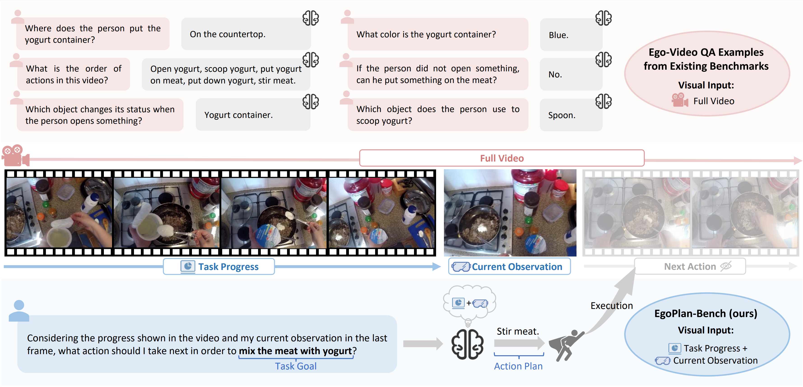

<div align="center">
<h1>
EgoPlan-Bench: Benchmarking Multimodal Large Language Models for Human-Level Planning

<a href='https://chenyi99.github.io/ego_plan/'></a>
<a href='https://arxiv.org/pdf/2312.06722'></a> 
<a href='https://drive.google.com/drive/folders/1qVtPzhHmCgdQ5JlMeAL3OZtvbHaXktTo?usp=sharing'></a> 
<a href='https://huggingface.co/spaces/ChenYi99/EgoPlan-Bench_Leaderboard'></a>
<a href='https://huggingface.co/ChenYi99/EgoPlan-Video-LLaMA-2-7B'></a>
</h1>

<p align="center">
  
</p>

</div>

## 📌Table of Contents
- [Introduction](#introduction)
- [Data](#data)
- [Getting Started](#getting-started)
- [Submission](#%EF%B8%8Fsubmission)
- [Citation](#citation)
- [Acknowledgement](#acknowledgement)

 

## 🚀Introduction


The pursuit of artificial general intelligence (AGI) has been accelerated by Multimodal Large Language Models (MLLMs), which exhibit superior reasoning, generalization capabilities, and proficiency in processing multimodal inputs. A crucial milestone in the evolution of AGI is the attainment of human-level planning, a fundamental ability for making informed decisions in complex environments, and solving a wide range of real-world problems. Despite the impressive advancements in MLLMs, a question remains: **How far are current MLLMs from achieving human-level planning?**

To shed light on this question, we introduce EgoPlan-Bench, a comprehensive benchmark to evaluate the planning abilities of MLLMs in real-world scenarios from an egocentric perspective, mirroring human perception. EgoPlan-Bench emphasizes the evaluation of planning capabilities of MLLMs, featuring realistic tasks, diverse action plans, and intricate visual observations. Our rigorous evaluation of a wide range of MLLMs reveals that EgoPlan-Bench poses significant challenges, highlighting a substantial scope for improvement in MLLMs to achieve human-level task planning. To facilitate this advancement, we further present EgoPlan-IT, a specialized instruction-tuning dataset that effectively enhances model performance on EgoPlan-Bench. 

This repository describes the usage of our evaluation data (EgoPlan-Val and EgoPlan-Test) and instruction-tuning data (EgoPlan-IT), and provides the corresponding codes for evaluating and fine-tuning MLLMs on our benchmark. 
Welcome to evaluate your models and explore methods to enhance the models' EgoPlan capabilities on our benchmark!


## 📝Data

### Egocentric Videos
The EgoPlan datasets are constructed based on the two existing egocentric video sources: Epic-Kitchens-100 and Ego4D.

Download the RGB frames of [Epic-Kitchens-100](https://github.com/epic-kitchens/epic-kitchens-download-scripts). The folder structure of the dataset is shown below:
```
EPIC-KITCHENS
└── P01
    └── rgb_frames
        └── P01_01
            ├── frame_0000000001.jpg
            └── ...
```

Download the videos of [Ego4D](https://ego4d-data.org/#download). The folder structure of the dataset is shown below:
```
Ego4D
└──v1_288p
    ├── 000786a7-3f9d-4fe6-bfb3-045b368f7d44.mp4
    └── ...
```
 
### EgoPlan Evaluation Data
Questions from the human-verified evaluation data are formatted as multiple-choice problems. MLLMs need to select the most reasonable answer from four candidate choices. The primary metric is Accuracy.

<div align="center">
<p align="center">
  
</p>
</div>

We divide the evaluation data into two subsets: [EgoPlan-Val](https://drive.google.com/file/d/1Hy-mWrtuDjuq29iCQxCQzk0htTJs8SHg/view?usp=drive_link) (containing 3,355 samples) for validation and [EgoPlan-Test](https://drive.google.com/file/d/1G3cH58qlXI11iRFc8R1oFXpHhEiOh4Bd/view?usp=sharing) (containing 1,584 samples) for test, wherein the ground-truth answers of EgoPlan-Test are kept non-public. 
Below shows an example from the validation set:
```
{
    "sample_id": 115,
    "video_source": "EpicKitchens",
    "video_id": "P01_13",
    "task_goal": "store cereal",
    "question": "Considering the progress shown in the video and my current observation in the last frame, what action should I take next in order to store cereal?",
    "choice_a": "put cereal box into cupboard",
    "choice_b": "take cereal bag",
    "choice_c": "open cupboard",
    "choice_d": "put cereal bag into cereal box",
    "golden_choice_idx": "A",
    "answer": "put cereal box into cupboard",
    "current_observation_frame": 760,
    "task_progress_metadata": [
        {
            "narration_text": "take cereal bag",
            "start_frame": 36,
            "stop_frame": 105
        },
        {
            "narration_text": "fold cereal bag",
            "start_frame": 111,
            "stop_frame": 253
        },
        {
            "narration_text": "put cereal bag into cereal box",
            "start_frame": 274,
            "stop_frame": 456
        },
        {
            "narration_text": "close cereal box",
            "start_frame": 457,
            "stop_frame": 606
        },
        {
            "narration_text": "open cupboard",
            "start_frame": 689,
            "stop_frame": 760
        }
    ],  
}
```

### EgoPlan Training Data (EgoPlan-IT)
We provide an automatically constructed instruction-tuning dataset [EgoPlan_IT](https://drive.google.com/file/d/139UXIgOXbK55tNlK03TBrdSWXdupfrL5/view?usp=drive_link), which contains 50K samples, for fine-tuning the model. Below shows an example from EgoPlan-IT:
```
{
    "sample_id": 39,
    "video_source": "EpicKitchens",
    "video_id": "P07_113",
    "task_goal": "Cut and peel the onion",
    "question": "Considering the progress shown in the video and my current observation in the last frame, what action should I take next in order to cut and peel the onion?",
    "answer": "grab onion",
    "current_observation_frame": 9308,
    "task_progress_metadata": [
        {
            "narration_text": "open drawer",
            "start_frame": 9162,
            "stop_frame": 9203
        },
        {
            "narration_text": "grab knife",
            "start_frame": 9214,
            "stop_frame": 9273
        },
        {
            "narration_text": "close drawer",
            "start_frame": 9272,
            "stop_frame": 9303
        }
    ],
    "negative_answers": [
        "open drawer",
        "grab knife",
        "close drawer",
        "slice onion",
        "remove peel from onion",
        "peel onion"
    ]
}
```


## 💻Getting Started

### 1. Installation
Clone the repo and install dependent packages:

  ```bash
  git clone https://github.com/ChenYi99/EgoPlan.git
  cd EgoPlan
  pip install -r requirements.txt
  ```

### 2. Data Preparation

**Prepare Egocentric videos:** Download the RGB frames of [Epic-Kitchens-100](https://github.com/epic-kitchens/epic-kitchens-download-scripts) and the videos of [Ego4D](https://ego4d-data.org/#download). 

**Prepare EgoPlan datasets:** Download the validation data set [EgoPlan_validation.json](https://drive.google.com/file/d/1Hy-mWrtuDjuq29iCQxCQzk0htTJs8SHg/view?usp=drive_link) and the training dataset [EgoPlan_IT.json](https://drive.google.com/file/d/139UXIgOXbK55tNlK03TBrdSWXdupfrL5/view?usp=drive_link). Put these two JSON files under the directory [data/](data).

For details of the data structure, please refer to [Data](#data).


### 3. Model Weights
We use [Video-LLaMA](https://github.com/DAMO-NLP-SG/Video-LLaMA) as an example for evaluation and instruction-tuning.

#### Prepare the pretrained model checkpoints
- The checkpoint of the vanilla Video-LLaMA can be downloaded from
[Video-LLaMA-2-7B-Finetuned](https://huggingface.co/DAMO-NLP-SG/Video-LLaMA-2-7B-Finetuned).
- Alternatively, the checkpoint of the Video-LLaMA that has been further tuned on our EgoPlan-IT can be downloaded from
[EgoPlan-Video-LLaMA-2-7B](https://huggingface.co/ChenYi99/EgoPlan-Video-LLaMA-2-7B).

#### Prepare the pretrained LLM weights
Video-LLaMA is based on Llama2 Chat 7B. The corresponding LLM weights can be downloaded from [Llama-2-7b-chat-hf](https://huggingface.co/meta-llama/Llama-2-7b-chat-hf).

#### Prepare weights for initializing the Visual Encoder and Q-Former (optional)
If the server cannot access the Internet, the following weights should be downloaded in advance:<br>
- VIT ([eva_vit_g.pth](https://storage.googleapis.com/sfr-vision-language-research/LAVIS/models/BLIP2/eva_vit_g.pth))<br>
- Q-Former ([blip2_pretrained_flant5xxl.pth](https://storage.googleapis.com/sfr-vision-language-research/LAVIS/models/BLIP2/blip2_pretrained_flant5xxl.pth))<br>
- Bert ([bert-base-uncased](https://huggingface.co/google-bert/bert-base-uncased))

### 4. Evaluation
#### Evaluating the Vanilla Video-LLaMA

Config the paths for model weights in [video_llama_eval_only_vl.yaml](src/video_llama/eval_configs/video_llama_eval_only_vl.yaml).<br>
Set the paths for the `project root`, `Epic-Kitchens-100 RGB frames` and `Ego4D videos` in [eval_video_llama.sh](scripts/eval_video_llama.sh).<br>
Then, run the script on 1xV100 (32G) GPU:
```bash
bash scripts/eval_video_llama.sh
```

#### Evaluating the Video-LLaMA Tuned on EgoPlan-IT
Config the paths for model weights in [egoplan_video_llama_eval_only_vl.yaml](src/video_llama/eval_configs/egoplan_video_llama_eval_only_vl.yaml).<br>
Set the paths for the `project root`, `Epic-Kitchens-100 RGB frames` and `Ego4D videos` in [eval_egoplan_video_llama.sh](scripts/eval_egoplan_video_llama.sh).<br>
Then, run the script on 1xV100 (32G) GPU:
```bash
bash scripts/eval_egoplan_video_llama.sh
```

[//]: # (#### Tips for Evaluation Settings)

[//]: # (For models unable to process multiple video clips, please refer to the example code for [evaluating the vanilla Video-LLaMA]&#40;#evaluating-the-vanilla-video-llama&#41;.)

[//]: # ()
[//]: # (For models capable of processing multiple video clips, please refer to the example code for [evaluating the Video-LLaMA tuned on EgoPlan-IT]&#40;#evaluating-the-video-llama-tuned-on-egoplan-it&#41;. )

[//]: # (In our research paper, we have also used this setting for the vanilla Video-LLaMA to ensure a more consistent evaluation of our instruction-tuning approach.)

### 5. Training
For increasing instruction diversity, in addition to EgoPlan-IT, we also include an additional collection of 164K instruction data following [Video-LLaMA](https://github.com/DAMO-NLP-SG/Video-LLaMA):

* 3K image-based instructions from MiniGPT-4 [[link](https://github.com/Vision-CAIR/MiniGPT-4/blob/main/dataset/README_2_STAGE.md)]. 
* 150K image-based instructions from LLaVA [[link](https://huggingface.co/datasets/liuhaotian/LLaVA-Instruct-150K/raw/main/llava_instruct_150k.json)]. The images can be downloaded from [here](http://images.cocodataset.org/zips/train2014.zip).
* 11K video-based instructions from VideoChat [[link](https://github.com/OpenGVLab/InternVideo/tree/main/Data/instruction_data)]. The videos can be downloaded following the instructions from the official Github repo of [Webvid](https://github.com/m-bain/webvid).


Config the paths for model weights and datasets in [visionbranch_stage3_finetune_on_EgoPlan_IT.yaml](src/video_llama/train_configs/visionbranch_stage3_finetune_on_EgoPlan_IT.yaml).<br>
Set the path for the `project root` in [finetune_egoplan_video_llama.sh](scripts/finetune_egoplan_video_llama.sh).<br>
Then, run the script on 8xV100 (32G) GPUs:
```bash
bash scripts/finetune_egoplan_video_llama.sh
```

## 🖊️Submission
We are consistently maintaining an [EgoPlan-Bench Leaderboard](https://huggingface.co/spaces/ChenYi99/EgoPlan-Bench_Leaderboard).
To show your model's performance on our leaderboard, please contact [yichennlp@gmail.com](yichennlp@gmail.com) with attached prediction files for the validation and test sets.

We ONLY accept ".json" files. The submitted data format should be like:

    [
        {  
            "sample_id": "int",  
            "label": "str"
        },
        ...
    ]

where the "sample_id" field should be an integer and the "label" field should be a string within ["A","B","C","D"].
An example submission file for the validation set can be found [here](example_submission/submission_validation.json).


## 📚Citation
If you find our project helpful, hope you can star our repository and cite our paper as follows:

```
@misc{chen2024egoplanbenchbenchmarkingmultimodallarge,
  title={EgoPlan-Bench: Benchmarking Multimodal Large Language Models for Human-Level Planning}, 
  author={Yi Chen and Yuying Ge and Yixiao Ge and Mingyu Ding and Bohao Li and Rui Wang and Ruifeng Xu and Ying Shan and Xihui Liu},
  year={2024},
  eprint={2312.06722},
  archivePrefix={arXiv},
  primaryClass={cs.CV},
  url={https://arxiv.org/abs/2312.06722}, 
}
```

## 🙌Acknowledgement
This repo benefits from [Epic-Kitchens](https://epic-kitchens.github.io/2023), [Ego4D](https://ego4d-data.org/), 
[Video-LLaMA](https://github.com/DAMO-NLP-SG/Video-LLaMA), 
[LLaMA](https://github.com/facebookresearch/llama),
[MiniGPT-4](https://github.com/Vision-CAIR/MiniGPT-4), 
[LLaVA](https://github.com/haotian-liu/LLaVA), 
[VideoChat](https://github.com/OpenGVLab/Ask-Anything). Thanks for their wonderful works!
